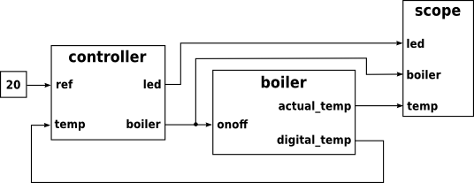
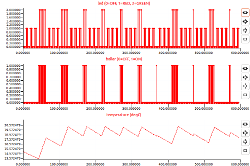

## Bang-Bang Temperature Control ##

!REQUIRES: Lablgtk2

This model is a reimplementation of the Mathworks Simulink example
[_Bang-Bang Control Using Temporal Logic_](http://www.mathworks.com/help/simulink/examples/bang-bang-control-using-temporal-logic.html).
The main differences with the original model are:

 * We manually track the bias and slope for integers representing rational
   values.

 * We use int for the integer values rather than int8.

The top level of this example comprises three nodes:

### Controller ###

The controller is discrete. It takes two inputs:

  * _reference temperature_

    This value is a constant 20°C, but it is encoded as a fixed-point integer
    so that it can be compared directly with the digital temperature value
    from the environment model. The reference temperature has a value
    between 0 (-15°C) and 255 (84.609375°C), i.e., a resolution of
    0.390625 per bit (0.390625 = 5 / 256 / 0.05).

  * _feedback temperature_

    A digital temperature measurement.

And provides two outputs:

  * _led_: the colour of a light emitting diode on the outside of the
    controller:

    * `0` = `off`,
    * `1` = `red` (not heating),
    * `2` = `green` (heating).

  * _boiler_: a signal that switches the boiler on (`1`) or off (`0`).

The main part of the controller is an automaton with two top-level states:

  * `Off`: The boiler is off. The LED is flashed red at 0.1 Hz (5 secs off, 5
    secs red).

  * `On`: The boiler is on. The LED is flashed red at 0.5 Hz (1 sec off, 1 sec
    green).

The controller always remains in the `Off` state for at least 40 seconds,
after which it will switch to the `On` state if the temperature is less than
the reference temperature.

The controller may not remain in the `On` state for more than 20 seconds. It
will switch to the `Off` state if the temperature becomes greater than the
reference temperature.

The on state contains an internal automaton that stays in a `High` state from
`t = 0` until the very first time that the measured temperature exceeds the
reference temperature (this is ensured by entry-by-history from `Off`). The
reason for this additional complication in the original Stateflow controller
is not clear; perhaps the intent was to heat at a faster rate the first time
the system is switched on? In our model, the effect is to delay an exit from
the `On` state by one reaction the first time the reference temperature is
attained.

### Boiler ###

Boiler is a hybrid model of the boiler temperature and a digital
thermometer.

The boiler temperature is modeled by a single integrator with an initial
value of 15°C. This value (cools) at a rate of -0.1 / 25 when the
boiler is off. It changes (heats) at a rate of 1.0 / 25 when the boiler is
on.

The digital thermometer is modelled in some detail. Effectively, it takes a
floating point temperature value in degrees centigrade and returns an
integer between 0 and 255 representing that value (see the discussion above
for the reference temperature).

The sensor itself has a bias of 0.75 and and a precision of 0.05, i.e., the
output voltage V is a function of the temperature T: `V = 0.05 * T + 0.75`. An
analog-to-digital converter (ADC) converts this voltage into an integer. By
scaling, quantization, and limiting.

### Scope ###

Scope is a discrete node. It is triggered every `sample_period` to plot the
LED output, the boiler command, and the actual temperature against time.

Note that, even though all of these signals are continuous, they are plotted
at discrete instants (as plotting is a side-effect) and the graph is thus
(linearly) interpolated.

### Simulation ###

The simulation output shows a staircased increase in temperature from 15°C
at `t = 0` to the 20°C just before `t = 500`. The initial rising edges have a
slope of 1.0/25 (the heating rate) and a duration of 20 seconds (the maximum
amount of time in the `On` state). The initial falling edges have a slope of
0.1/25 (the cooling rate) and a duration of 40 seconds (the minimum amount
of time in the `Off` state). After reaching the reference temperature, the
controller switches on and off to oscillate around the set-point.

The LED will flash green (`2`) during periods of heating, and red (`1`) during
periods of cooling, i.e., when not heating.

!SOURCEFILE: bangbang.zls

